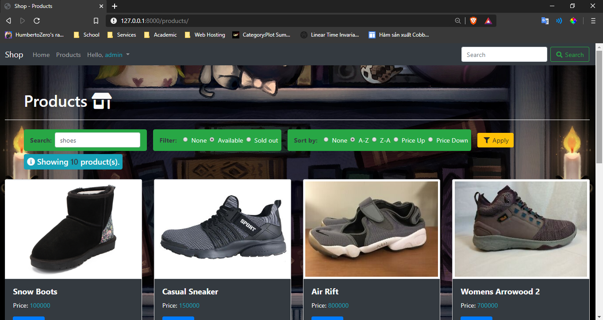
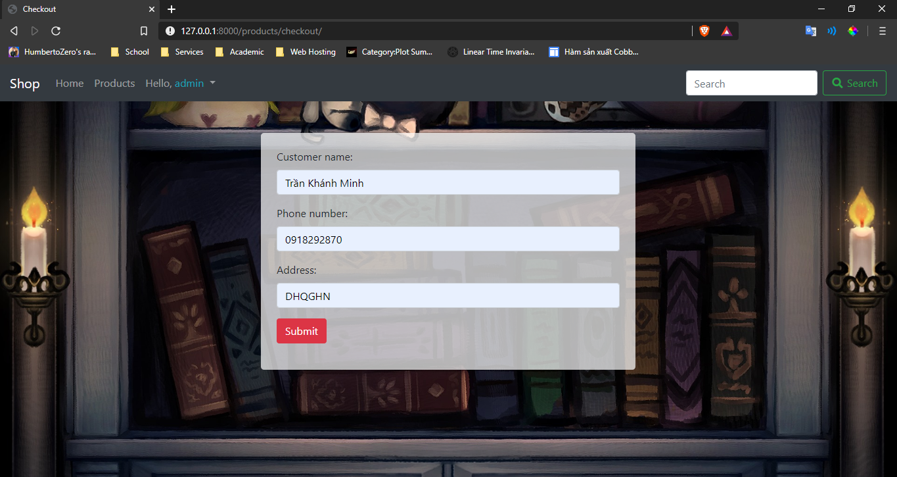
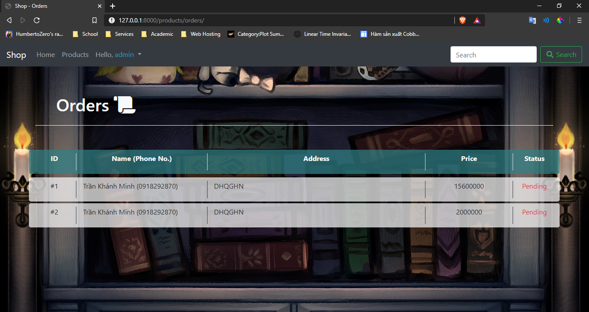

# Shop Management web app

## Mô tả
- Đây là một web chuyên về bán giày
- Được thiết kế đơn giản gọn nhẹ nhưng đầy đủ chức năng để mang sự tiện lợi cho cả người bán lẫn người mua.
- Giao dịch với khách hàng, tạo ra hoá đơn thanh toán cho cả khách hàng lẫn người bán, không hỗ trợ giao dịch trực truyến

## Chức năng
- Đăng ký/Đăng nhập với tư cách là khách hàng hoặc người bán hàng(thông qua page ẩn admin). Có hệ thống session lưu người dùng kể cả khi đã tắt browser(có các bảng của Django trong CSDL)
- Có page product đưa ra danh sách hàng, mỗi hàng sẽ có nút View Details để hiện thêm thông tin
- Trong thông tin sản phẩm, người mua có thể thêm hàng vào rỏ hàng với số lượng tuỳ thích. Sẽ thông báo "Đã cho vào rỏ hàng" nếu thêm vào thành công. Số lượng tồn kho sẽ giảm nếu hàng được thanh toán
- Ở đây có bảng Cart để lưu thông tin các món hàng. Các món hàng được phân biệt với nhau qua mã hàng và người mua, kèm theo số lượng và giá mỗi hàng.
- Có các hàm xử lý sao cho nhiều người dùng cùng thêm hàng cùng một lúc. Khi hết hàng mà người khác vốn đã thêm từ trước, thì món hàng đó sẽ bị mất, kèm theo một thông báo cho người dùng.
- Có page Cart - giỏ hàng để người dùng xem chi tiết rỏ hàng của mình. Ở đây dùng Group By để gộp lại bất kì hàng nào được thêm nhiều lần. Khách hàng có thể checkout, lưu lại hoá đơn giao dịch để thực hiện sau này.
- Trong page Cart, người dùng có thể Delete bất kì món hàng nào mình không muốn.
- Có page Order - hoá đơn để người dùng xem, hiện ra thông tin về hàng và người mua, tổng tiền và trạng thái gửi.

## Các câu lệnh SQL chính
- Lấy sản phẩm theo id riêng:  
SELECT * FROM `products` WHERE `product_id` = pid
- Lấy danh sách sản phẩm trong cart sau khi được Group By theo id sản phẩm:  
SELECT *, SUM(`cart`.`quantity`) AS `quantity`  FROM `cart` WHERE `user` = username  GROUP BY `cart`.`productID`, `cart`.`productName`, `cart`.`productImage`, `cart`.`sellPrice`, `cart`.`user`
- Lấy thông tin hàng được chọn bởi người dùng và cho vào giỏ hàng:  
INSERT INTO cart(`product_id`, `product_name`, `product_image`, `quantity`, `user`)
 VALUES (product_id, product_name, product_image, quantity, user)
- Xoá hàng khỏi giỏ nếu người dùng muốn hoặc do hết hàng:  
DELETE FROM cart  WHERE `user` = request.user.username AND `product_id` = pid
- Cập nhật số lượng trong giỏ nếu hàng tồn kho không đủ:  
UPDATE cart  SET quantity = in_stock  WHERE `user` = request.user.username AND `product_id` = pid
- Cập nhật số hàng tồn kho sau khi đã thanh toán:  
UPDATE products  SET quantity = quantity_in_stock  WHERE `product_id` = pid
- Hiện hoá đơn cho người dùng:  
SELECT * FROM `orderDJ` WHERE `user` = request.user.username
- Thêm chi tiết vào bảng orderDJ:  
INSERT INTO orderDJ(`user`, `customer_name`, `address`, `phone`, `total_price`) 
VALUES (user, customer_name, address, phone, total_price)

## Quá trình phát triển
- Định hình mục tiêu là làm web bán giày và nền tảng cho nó là Django
- Cả nhóm đầu tư vào học Django, xây dựng CSDL
- Xây dựng các thành phần back-end của Django, bắt đầu xây dựng chức năng
- Xây dựng front-end cho web với HTML, CSS, JS và Bootstrap. Đồng thời cũng dùng Jinja cho dynamic data
- Kiểm thử các chức năng như nhiều người cùng thêm và thanh toán hàng, hết hàng
- Hoàn thiện mọi thứ
  
## Ảnh demo web
- Homepage - landing page

- Register 

- Login

- Trang sản phẩm

- Chi tiết sản phẩm

- Giỏ hàng

- Chi tiết sản phẩm sau khi thêm vào giỏ

- Điền thông tin giao hàng

- Page đơn hàng
